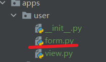
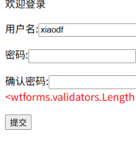
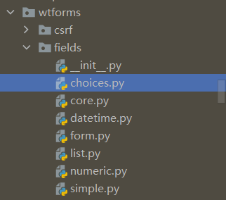
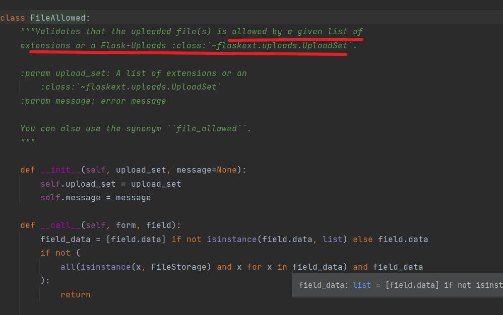

##  flask-wtf 

flask-wtf:集成了wtform并集成了csrf保护(学django的时候用到过)
和文件上传功能以及图形验证码   

- 安装
```commandline
pip install Flask-WTF
```

- 然后在需要的app中创建form.py名字可以自己拟定  
-     

之后进行定义

```python
from flask_wtf import FlaskForm
from wtforms import StringField,PasswordField
from wtforms.validators import DataRequired,length


class UserForm(FlaskForm):
    name = StringField('name',validators=[DataRequired(),length(min=4,max=12,message="用户名最少4位，最多12位")])
    pwd = PasswordField('密码',validators=[DataRequired(),length(min=6,max=12,message="密码最少为6位,最多12位")])

```

在view.py中引入  
```python

from flask import Blueprint, request, render_template
from .form import UserForm
user_bps = Blueprint(name='user', import_name=__name__)


@user_bps.route('/user',methods=['GET', 'POST'], endpoint='user')
def login():
    if request.method == 'GET':
        uform = UserForm()
        return render_template('user/login.html',uform=uform)
    if request.method == 'POST':
        pass

```

在html中使用模板调用  
```html
<!DOCTYPE html>
<html lang="en">
<head>
    <meta charset="UTF-8">
    <title>登录页面</title>
</head>
<body>
    <div>欢迎登录</div>
    <form action=""method="post">
        {{ uform.csrf_token }} <!--让表单产生token值-->
        <p>{{ uform.name }}</p>
        <p>{{ uform.pwd }}</p>
        <input type="submit">
    </form>
</body>
</html>
```


### 关于csrf_token   
为了防止csrf跨站请求伪造攻击,我们需要引入csrf_token
可以看到上方对表单进行了csrf_token设置    

当然,也可以设置全局csrf保护   
```python
import os.path
from flask import Flask
from .user.view import user_bps
from flask_wtf.csrf import CSRFProtect

probj_folder = os.path.dirname(os.path.dirname(__file__))


def create_app():
    app = Flask(__name__, template_folder=os.path.join(probj_folder, 'templates'))

    # 开启csrf全局保护
    csrf = CSRFProtect()
    csrf.init_app(app)

    app.secret_key = 'jgabkd671;.as1sdh1278uiophsh'  # 要使用csrf保护的话需要设置secret_key
    app.register_blueprint(user_bps)

```


### 提交验证 
> 通过 uform.validate_on_submit()  来校验   
> 其实就是一个FlaskForm对象.validate_on_submit()
```python
@user_bps.route('/user',methods=['GET', 'POST'], endpoint='user')
def login():
        uform = UserForm()
        if uform.validate_on_submit():
            print(uform.name.data)    #利用.data可以获取返回值,不写的话返回的是生成的html表单输入
            print(uform.pwd.data)
        return render_template('user/login.html',uform=uform)
    
```

值得注意的是它会验证请求方式是不是post如果不是那就不调用    
所以这里才没有写请求方式判断 `if request.method == 'POST':`    **

##   自定义校验 
自定义校验时候有一个规定,那就是起名要为`validate_name`因为wtform\form下的源码中写有这个的实现   
大致就是它会读取定义的form中有没有自己声明validate_%s,如果有的话就将其添加进去
html中这样写
```html
<!DOCTYPE html>
<html lang="en">
<head>
    <meta charset="UTF-8">
    <title>登录页面</title>
</head>
<body>
    <div>欢迎登录</div>
    <form action=""method="post">
        {{ uform.csrf_token }} <!--让表单产生token值-->
        <p>{{ uform.name }}{{ uform.name.errors.0 }}</p>
        <p>{{ uform.pwd }}</p>
        <input type="submit">
    </form>
</body>
</html>
```


然后在form定义中这样写   

要自定义验证谁就写def validate_谁,这样的话比较清晰
```python
class UserForm(FlaskForm):
    name = StringField('name', validators=[DataRequired(), length(min=4, max=12, message="用户名最少4位，最多12位")])
    pwd = PasswordField('密码', validators=[DataRequired(), length(min=6, max=12, message="密码最少为6位,最多12位")])

    # 自定义校验

    def validate_name(self,data):
        if self.name.data[0].isdigit():  # 如果名称以数字开头则拒绝
            print('名字是以数字开头')
            print(self.name.data) #这样可以直接拿到输入的name的值
            print('data是------------------',data) #tips:这样拿到的是一个表单
            print(type(data))
            #tips:如果是以数字开头那么就要抛出异常了
            raise ValidationError('用户名不能以数字开头')
```

>  注意 `{{ uform.name.errors.0 }}` 中的uform.name.errors中的errors是一个元组,
> 抛出一个异常就会往其中放入一个异常,所以我们拿出异常可以使用模板语法的索引方式,即.0来拿出第一个异常
> 


## 关于label   
在创建表的时候可以在Field(表单域)中加入label,FlaskFrom给定了很多可以选择的功能  
```python
class UserForm(FlaskForm):
    name = StringField(label='name', validators=[DataRequired(), length(min=4, max=12, message="用户名最少4位，最多12位")])
    pwd = PasswordField(label='密码', validators=[DataRequired(), length(min=6, max=12, message="密码最少为6位,最多12位")])
    confirm_pwd = PasswordField(label='确认密码', validators=[DataRequired(), length(min=6, max=12)])

```    
然后可以在html中这么写
```html
<form action="" method="post">
    {{ uform.csrf_token }} <!--让表单产生token值-->
    <p>{{ uform.name.label }}:{{ uform.name }}<span>{{ uform.name.errors.0 }}</span></p>
    <p>{{ uform.pwd.label }}:{{ uform.pwd }}<span style="color: red">{{ uform.pwd.errors}}</span></p>
    <p>{{ uform.confirm_pwd.label }}:{{ uform.confirm_pwd }}<span style="color: red">{{ uform.confirm_pwd.errors}}</span></p>
    <input type="submit">
</form>
```

>为什么要用errors.0呢？因为errors返回的是一个列表,我们想要获取其中的值用.0来索引取值非常方便

这样写的话页面会有这样的效果  


## Equalto('xxx',message='xxx')  注意第一个参数一定要加上引号,不然会产生意想不到的错误 
>有这样一个使用场景,之前我们做密码判断的时候要求二次输入密码,还需要我们手动判断
> 这个wtforms.validators给我们提供了一个叫EqualTo的方法,我们可以用这个来指定待判定的表单域   
> 它还可以指定一个message,来指定发生错误后的提示信息
```python

from wtforms.validators import DataRequired, length, ValidationError,EqualTo  
class UserForm(FlaskForm):
    name = StringField(label='name', validators=[DataRequired(), length(min=4, max=12, message="用户名最少4位，最多12位")])
    pwd = PasswordField(label='密码', validators=[DataRequired(), length(min=6, max=12, message="密码最少为6位,最多12位")])
    confirm_pwd = PasswordField(label='确认密码', validators=[DataRequired(), length(min=6, max=12),EqualTo('pwd',message='两次密码不一致')])
```

关于手机号码的验证思路 
与之前判断名称的相似
```python
class UserForm(FlaskForm):
    name = StringField(label='用户名', validators=[DataRequired(), length(min=4, max=12, message="用户名最少4位，最多12位")])
    pwd = PasswordField(label='密码', validators=[DataRequired(), length(min=6, max=12, message="密码最少为6位,最多12位")])
    confirm_pwd = PasswordField(label='确认密码',
                                validators=[DataRequired(), length(min=6, max=12, message="密码最少为6位,最多12位"),
                                            EqualTo('pwd', message="两次密码不一致")])

    phone_num = StringField(label='输入手机号', validators=[DataRequired(), length(min=11, max=11, message='格式有误,请检查')])
     def validate_phone_num(self, data):
            phone = data.data
            res = re.search(r'^1[35678]\d{9}$', phone)
            if res == None: #判断,如果不匹配那么返回的就是none，那就甩出报错
                raise ValidationError('号码格式错误')
```
### 也有更加优雅的写法,利用Regex验证器验证
```python
    phone_num = StringField(label='输入手机号', validators=[DataRequired(), length(min=11, max=11, message='格式有误,请检查'),Regexp(r'^1[35678]\d{9}$',message='号码格式错误')])

```
这样就不需要手动来专门自定义验证了!!!

## 各种field类型
```python
__all__ = (
    "IntegerField",
    "DecimalField",
    "FloatField",
    "IntegerRangeField",
    "DecimalRangeField",
)
__all__ = (
    "BooleanField",
    "TextAreaField",
    "PasswordField",
    "FileField",
    "MultipleFileField",
    "HiddenField",
    "SearchField",
    "SubmitField",
    "StringField",
    "TelField",
    "URLField",
    "EmailField",
    "ColorField",
)
```
言而总之,都在这里
  

自己可以查看来选择合适的field
## 各种验证   
```python

__all__ = (
    "DataRequired",
    "data_required",
    "Email",
    "email",
    "EqualTo",
    "equal_to",
    "IPAddress",
    "ip_address",
    "InputRequired",
    "input_required",
    "Length",
    "length",
    "NumberRange",
    "number_range",
    "Optional",
    "optional",
    "Regexp",
    "regexp",
    "URL",
    "url",
    "AnyOf",
    "any_of",
    "NoneOf",
    "none_of",
    "MacAddress",
    "mac_address",
    "UUID",
    "ValidationError",
    "StopValidation",
    "readonly",
    "ReadOnly",
    "disabled",
    "Disabled",
)


```

## 详解文件上传  

需要用到的包 
```python
from flask_wtf.file import FileField, FileRequired, FileAllowed
```

FileAllowed验证器只需要我们给它提供一个允许的文件格式的列表即可,不用像之前那样自己定义文件检查方法了  
```python
    icon = FileField(label='选择头像', validators=[FileRequired(), FileAllowed(['jpg','png','gif'],message='格式有误,请重选')])

```
我们可以用之前学过的filestorage的两个常用方法即.filename和.save()来进行图片的名称获得和图片的保存  
注意本次写的代码略乱!!之后在项目中使用即可