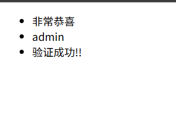
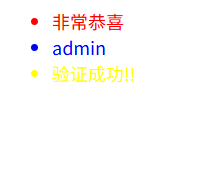

## 闪现类型   
闪现类型会存于session当中,所以我们使用之前一定要记得设置secret_key     

### 闪现类型的使用   
```python
from flask import Blueprint, request, render_template, flash

user_bp = Blueprint('user', __name__, url_prefix='/user')


@user_bp.route('/login', methods=['GET', 'POST'],endpoint='login')
def login_rt():
    if request.method == 'POST':

        name = request.form.get('username')
        pwd = request.form.get('pwd')
        if name == 'admin':
            flash('验证成功!!')  # tips:相当于也是对页面传出一个消息,只不过是不通过render_template了
            return render_template('user/index.html')
    return render_template('user/login.html')
```

```html
<!DOCTYPE html>
<html lang="en">
<head>
    <meta charset="UTF-8">
    <title>首页</title>
</head>
<body>
{#获取闪现的消息们#}

    
    
        <ul>
            
                <li>{{ message }}</li>
            
        </ul>
    

</body>
</html>
```

>  用get_flashed_messages()可以获得闪现类型的信息，返回的是一个列表   
> 然后以messages变量接收它,注意闪现对象可以有多个，所以我们可以用遍历的方式拿到它们      

> 

就像这样,会取到所有的  

###  详细解析  
flash()方法中还可以指定种类  
`flash(message: str, category: str = "message")`

其中可以指定的种类是很多的 


### 分类闪现  
上面说到flash可以指定种类,所以我们可以使用指定的种类来进行返回   
```python
def login_rt():
    if request.method == 'POST':

        name = request.form.get('username')
        pwd = request.form.get('pwd')
        if name == 'admin':
            flash('非常恭喜',category='error')
            flash(name,category='info')
            flash('验证成功!!',category='warning')  # tips:相当于也是对页面传出一个消息,只不过是不通过render_template了
            return render_template('user/index.html')
    return render_template('user/login.html')
```

从flash()的源代码中我们可以看到
```python
def get_flashed_messages(
    with_categories: bool = False, category_filter: t.Iterable[str] = ()
) -> list[str] | list[tuple[str, str]]:
    """Pulls all flashed messages from the session and returns them.
    Further calls in the same request to the function will return
    the same messages.  By default just the messages are returned,
    but when `with_categories` is set to ``True``, the return value will
    be a list of tuples in the form ``(category, message)`` instead.
```

如果我们将html中get_flashed_messages()中的with_categories设置为True  
那么就会从设置好的带有种类的flash中返回一个列表,存放的是(category,message)元组   
这样我们就可以既拿到信息又能够根据种类设置不同的样式   
```html
<!DOCTYPE html>
<html lang="en">
<head>
    <meta charset="UTF-8">
    <title>首页</title>
    <style>
        .info{
            color: blue;
        }
        .warning{
            color: yellow;
        }
        .error{
            color: red;
        }
    </style>
</head>
<body>
{#获取闪现的消息们#}

    
        <ul>
            
                <li class="{{ category }}">{{ message }}</li>
            
        </ul>
    

</body>
</html>
```
  

一个很好的写法   
像下面这样写,可以访问/ 但是如果不进行登录校验的话就不会重定向,自然也就不会有内容  

```python

@user_bp.route('/',endpoint='index')
def index_rt():
    return render_template('user/index.html')


@user_bp.route('/login', methods=['GET', 'POST'],endpoint='login')
def login_rt():
    if request.method == 'POST':

        name = request.form.get('username')
        pwd = request.form.get('pwd')
        if name == 'admin':
            flash('非常恭喜',category='error')
            flash(name,category='info')
            flash('验证成功!!',category='warning')  # tips:相当于也是对页面传出一个消息,只不过是不通过render_template了
            # return render_template('user/index.html')
            return redirect(url_for('user.index'))
    return render_template('user/login.html')
```