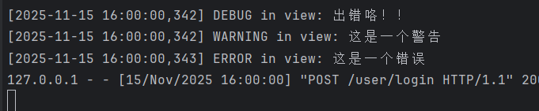

## 日志的使用  
你可以在 `else` 分支中使用 Flask 自带的 logger 来记录日志。Flask 应用实例（`app`）有一个内置的 logger，可以通过 `current_app.logger` 在视图函数中访问（前提是你的 Blueprint 已正确注册到 Flask app 上下文中）。

不过注意：你当前代码中没有导入 `current_app`，所以需要先导入它。

### ✅ 修改建议如下：

```python
from flask import Blueprint, request, render_template, flash, redirect, url_for, current_app

user_bp = Blueprint('user', __name__, url_prefix='/user')

@user_bp.route('/login', methods=['GET', 'POST'], endpoint='login')
def login_rt():
    if request.method == 'POST':
        name = request.form.get('username')
        pwd = request.form.get('pwd')
        if name == 'admin':
            flash('非常恭喜', category='error')
            flash(name, category='info')
            flash('验证成功!!', category='warning')
            return redirect(url_for('user.index'))
        else:
            # 使用 Flask 的 logger 记录登录失败信息
            current_app.logger.warning(f"Login failed for username: {name}")
            # 也可以记录密码（但生产环境切勿记录密码！）
            # current_app.logger.warning(f"Login failed - Username: {name}, Password: {pwd}")
    return render_template('user/login.html')
```

---

### 🔍 补充说明：

- `current_app` 是 Flask 提供的代理对象，指向当前激活的应用实例。
- 默认情况下，Flask 的 logger 名称为 `'flask.app'`。
- 如果你没有在主应用中配置日志级别或 handler，可能看不到日志输出。你可以确保在创建 Flask app 时启用了调试模式或手动配置了日志。

例如，在 `app.py` 中：

```python
app = Flask(__name__)
app.logger.setLevel(logging.DEBUG)  # 或 WARNING/ERROR 等
```

或者直接运行在 `debug=True` 模式下，Flask 会自动启用基本的日志输出。

---

### ⚠️ 安全提醒：

**永远不要在日志中记录用户密码（即使是明文测试）**，哪怕是在开发阶段也容易造成泄露风险。上面示例中注释掉的那行就是反面例子。

---

如有需要，也可以自定义 logger，但对大多数场景，`current_app.logger` 足够使用。


## logger的不同  
- logger.debug()
- logger.warning()
- logger.error()  


```python
@user_bp.route('/login', methods=['GET', 'POST'],endpoint='login')
def login_rt():
    if request.method == 'POST':

        name = request.form.get('username')
        pwd = request.form.get('pwd')
        if name == 'admin':
            flash('非常恭喜',category='error')
            flash(name,category='info')
            flash('验证成功!!',category='warning')  # tips:相当于也是对页面传出一个消息,只不过是不通过render_template了
            # return render_template('user/index.html')
            return redirect(url_for('user.index'))
        else:
            current_app.logger.debug('出错咯！！')
            current_app.logger.warning('这是一个警告')
            current_app.logger.error('这是一个错误')
    return render_template('user/login.html')
```


## python中的logging   
当然可以！Python 的 `logging` 模块是官方推荐的记录程序运行信息（如调试、警告、错误等）的标准方式。相比 `print()`，它更灵活、可配置、适合生产环境。

---

## 🧠 一、核心概念（4个关键组件）

| 组件 | 作用 |
|------|------|
| **Logger** | 日志记录器，你的代码通过它来写日志（如 `logger.info("xxx")`） |
| **Handler** | 决定日志输出到哪里（控制台、文件、网络等） |
| **Formatter** | 定义日志的格式（时间、级别、消息等） |
| **Level** | 日志级别，控制哪些日志会被记录 |

---

## 🔢 二、日志级别（从低到高）

| 级别 | 数值 | 用途 |
|------|------|------|
| `DEBUG` | 10 | 详细调试信息，通常只在开发时用 |
| `INFO` | 20 | 一般信息，确认程序按预期运行 |
| `WARNING` | 30 | 警告，表示可能有问题，但程序还能继续运行 |
| `ERROR` | 40 | 错误，某个功能不能正常工作 |
| `CRITICAL` | 50 | 严重错误，程序可能无法继续运行 |

> ✅ 默认情况下，**只有 WARNING 及以上级别**的日志会被输出。

---

## 🚀 三、快速入门：最简单的例子

```python
import logging

# 基本配置（输出到控制台，格式简单）
logging.basicConfig(level=logging.DEBUG)

logging.debug("这是调试信息")
logging.info("程序启动成功")
logging.warning("磁盘空间不足！")
logging.error("数据库连接失败")
logging.critical("系统崩溃！")
```

**输出：**
```
DEBUG:root:这是调试信息
INFO:root:程序启动成功
WARNING:root:磁盘空间不足！
ERROR:root:数据库连接失败
CRITICAL:root:系统崩溃！
```

> 💡 `basicConfig()` 是快速配置方式，适合小型脚本。

---

## 📁 四、进阶：输出到文件 + 自定义格式

```python
import logging

# 配置日志：输出到文件，带时间、级别、消息
logging.basicConfig(
    level=logging.INFO,
    filename='app.log',          # 日志写入文件
    filemode='a',                # 追加模式
    format='%(asctime)s - %(levelname)s - %(message)s',
    datefmt='%Y-%m-%d %H:%M:%S'  # 时间格式
)

logging.info("用户登录成功")
logging.warning("尝试了非法操作")
```

**生成的 `app.log` 文件内容：**
```
2025-11-15 16:40:00 - INFO - 用户登录成功
2025-11-15 16:40:00 - WARNING - 尝试了非法操作
```

---

## 🛠️ 五、专业用法：使用 Logger 对象（推荐）

`basicConfig()` 全局生效，不适合大型项目。推荐为每个模块创建自己的 logger：

```python
# my_app.py
import logging

# 创建一个 logger（通常用 __name__ 作为名字）
logger = logging.getLogger(__name__)
logger.setLevel(logging.DEBUG)

# 创建 handler：输出到控制台
console_handler = logging.StreamHandler()
console_handler.setLevel(logging.DEBUG)

# 创建 formatter
formatter = logging.Formatter(
    '%(asctime)s - %(name)s - %(levelname)s - %(message)s'
)
console_handler.setFormatter(formatter)

# 把 handler 添加到 logger
logger.addHandler(console_handler)

# 使用
logger.info("开始处理数据")
logger.error("解析失败！")
```

**输出：**
```
2025-11-15 16:45:00 - __main__ - INFO - 开始处理数据
2025-11-15 16:45:00 - __main__ - ERROR - 解析失败！
```

> ✅ 这种方式可以：
> - 多个模块各自记录日志
> - 控制不同模块的日志级别
> - 同时输出到文件和控制台

---

## 📦 六、同时输出到控制台和文件

```python
import logging

logger = logging.getLogger('my_logger')
logger.setLevel(logging.DEBUG)

# 文件 handler
file_handler = logging.FileHandler('debug.log')
file_handler.setLevel(logging.DEBUG)

# 控制台 handler
console_handler = logging.StreamHandler()
console_handler.setLevel(logging.INFO)

# 格式
formatter = logging.Formatter('%(levelname)s - %(message)s')
file_handler.setFormatter(formatter)
console_handler.setFormatter(formatter)

logger.addHandler(file_handler)
logger.addHandler(console_handler)

# 测试
logger.debug("这个只写入文件")
logger.info("这个既打印又写入文件")
```

---

## 🌐 七、在 Flask / Django 中使用 logging

### Flask 示例：
```python
from flask import Flask
import logging

app = Flask(__name__)

# 配置 Flask 内置 logger
app.logger.setLevel(logging.INFO)
handler = logging.FileHandler('flask.log')
handler.setFormatter(logging.Formatter(
    '%(asctime)s - %(levelname)s - %(message)s'
))
app.logger.addHandler(handler)

@app.route('/login')
def login():
    app.logger.info("用户尝试登录")
    return "OK"
```

> ✅ Flask 应用自带 `app.logger`，可以直接用。

---

## ✅ 最佳实践建议

1. **不要用 `print()` 记录日志**，用 `logging`
2. **开发用 `DEBUG`，生产用 `INFO` 或更高**
3. **敏感信息（密码、token）不要记入日志**
4. **日志文件要定期轮转（可用 `RotatingFileHandler`）**
5. **每个模块用 `logger = logging.getLogger(__name__)`**

---

## 🔄 补充：日志轮转（防止日志文件太大）

```python
from logging.handlers import RotatingFileHandler

handler = RotatingFileHandler(
    'app.log',
    maxBytes=10*1024*1024,  # 10MB
    backupCount=5            # 保留5个备份
)
```

---

如果你现在写一个脚本或 Web 项目，直接这样开头就很规范：

```python
import logging
logging.basicConfig(
    level=logging.INFO,
    format='%(asctime)s - %(levelname)s - %(message)s'
)
```

然后随时用 `logging.info("xxx")` 即可！


### 自己代码的示例  
```python
def create_app():
    base_dir = os.path.dirname(os.path.dirname(os.path.abspath(__file__)))
    template_folder = os.path.join(base_dir, 'templates')
    print('--------------\n',template_folder)
    app = Flask(__name__,template_folder=template_folder)
    app.config.from_object(configdict['default'])
    app.register_blueprint(user_bp)

    #配置flask内置logger
    logger = logging.getLogger('app')
    logger.setLevel(logging.DEBUG)
    handler = logging.FileHandler('flask.log')
    formatter = logging.Formatter('%(asctime)s - %(name)s - %(levelname)s - %(message)s')
    handler.setFormatter(formatter)
    logger.addHandler(handler)
    
    logger.info('这是一条信息')
    logger.warning('测试警告')

    logger.error('测试错误·')

    logger.debug('测试调试')

    return app

```
