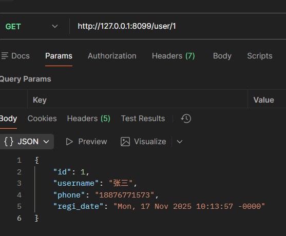
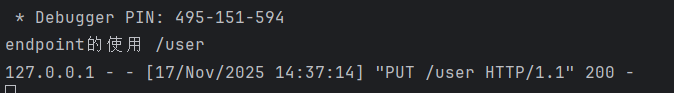
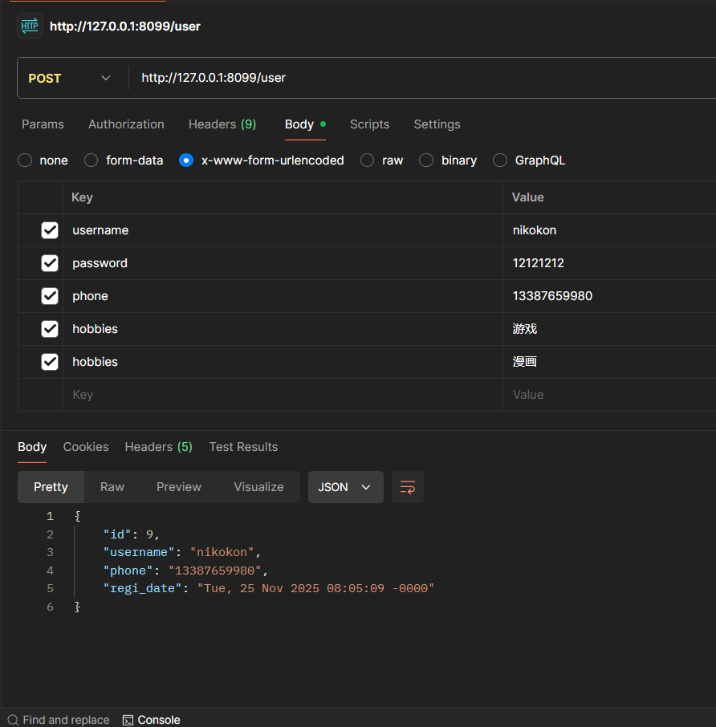
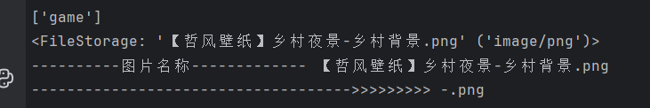
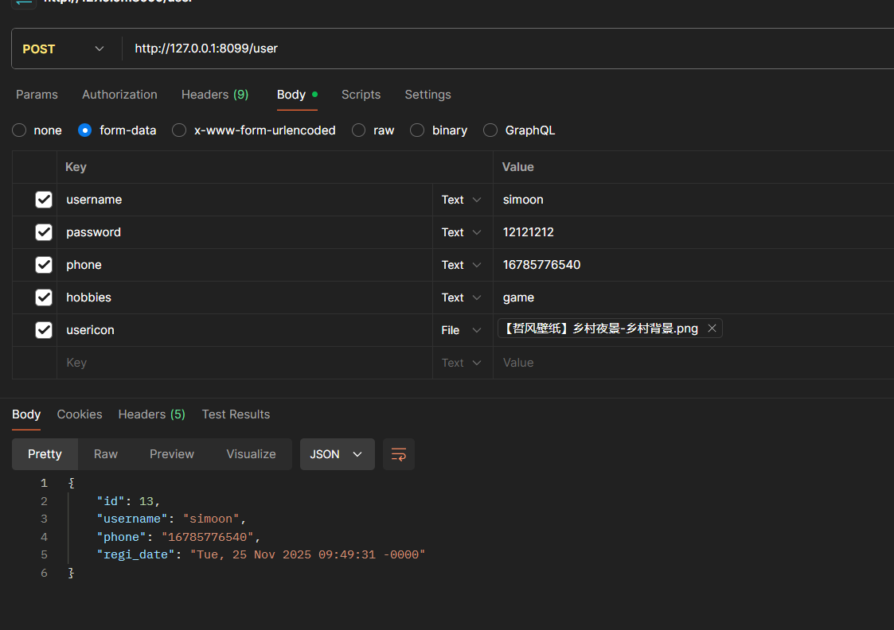

## 参数传入和端点  

### 回顾  
- fbv和cbv  
之前django的学习了解了fbv和cbv的概念  
在flask的restful中也使用了cbv   
为什么要使用cbv呢？   
因为之前我们进行视图的编写(用fbv)的时候,是我们自己来处理一系列的“动作”的   
这样维护麻烦且因前后端不分离，要求后端的逻辑性要非常强，出bug难以维护  
但是采用了cbv和前后端分离后，我们只需要写好接口，由前端开发人员来调用就好了  

之前我们写的路由都是单独的，增删改查的路由都不一样，但是现在,它们可以用同一个路由  
我们只需要处理不同的动作就行了!!!

路径的产生是通过api.add_resource(Resource的子类`就是我们定义的cbv`,'路由')  
如我们写的 
```python
user_api.add_resource(User_cbv, '/user')
```   


### 详细讲解参数   
之前的初识部分直接进行了全部查询,如果想定制查询那么是需要传入参数的   
```python
from flask import Blueprint
from flask_restful import Resource, Api, marshal_with, marshal, fields
from .models import User
user_bp = Blueprint('user', __name__)
user_api = Api(user_bp)
resource_fields = {
    'id': fields.Integer,
    'username': fields.String,
    'phone': fields.String,
    'regi_date': fields.DateTime
}


class User_cbv(Resource):
    # @marshal_with(resource_fields)
    def get(self):
        return {'msg': 'hello'}

class  User_single(Resource):  #单独只拿出一个用户的数据
    @marshal_with(resource_fields)
    def get(self,id):
        info = User.query.get(id)
        return info


    def put(self,id):
        pass
    def delete(self,id):
        pass


user_api.add_resource(User_cbv, '/user')
user_api.add_resource(User_single, '/user/<int:id>') #传入一个用户id
```

这里我们重新开了一个CBV来进行测试  
注意添加resource的时候后面传入的路由我们有自己指定的规则,即必须是int类型,和我们的model保持一致  



### endpoint端点  
这个之前做fbv的时候就已经学过了 
但是现在是cbv,该写到哪里呢？  
其实写到api的资源添加部分就可以了  

例如:
```python
class User_cbv(Resource):
    @marshal_with(resource_fields)
    def get(self):
        users=User.query.all()
        return users
    def put(self):
        #tips:假设我们在put的时候需要这all_user,这个路由,那么我们就将其返回
        print('endpoint的使用',url_for('user.all_user'))
        return {'msg':'成功'}

user_api.add_resource(User_cbv, '/user',endpoint='all_user')
```

     

其实大体上跟写fbv的时候的endpoint的感觉是差不多的  


### reqparse  
reqparse的存在就是像前后端不分离的时候的wt-form一样   
步骤如下  
1. 定义一个解析器对象并添加要进行验证的参数 
```python
parser = reqparse.RequestParser()  #tips:产生了一个解析对象
#tips:添加参数部分,注意要和前端的对应起来
# parser.add_argument('id',type=int,required=True,help='必须输入id')
parser.add_argument('username',type=str,help='用户名不能为空',location=['form'])
parser.add_argument('password',required=True,help='密码不能为空',location=['form'])
parser.add_argument('hobbies',action='append',location=['form'])
def phone_validator(phone):
    if re.match(r'^1[3-9]\d{9}$',phone):
        return phone
    raise ValueError('手机号格式有误')
parser.add_argument('phone',type=phone_validator,location=['form'])

# important:也可以像下面这样写，不适用验证函数
# parser.add_argument('phone',type=inputs.regex(r'^1[3-9]\d{9}$'),location='json') #tips:也可以这样写

```
2. 在api中进行调用  
```python
    def post(self):
        #tips:解析请求数据进行验证
        parser_args = parser.parse_args()  #拿到提交的参数，也就是上面我们定义的parser中的参数
        #下面这些本质上就是取出post过来的值,只不过这是restful写法，理解成username=request.form.get('username')这样就会容易理解了
        username = parser_args.get('username')  #tips:或者写成parser_args['username']也是可以的
        password = parser_args.get('password')
        phone = parser_args.get('phone')
        hobbies = parser_args.get('hobbies') #可以看看，就不往数据库中存了
        print(hobbies)
        # 创建user对象
        user = User()
        user.username = username
        user.password = password
        user.phone = phone

        db.session.add(user)
        db.session.commit()
        return user
```

### 对于有些多选框的数据的处理  
我们可以使用action='append'  来进行处理

```python
hobbies = parser_args.get('hobbies')  # 可以看看，就不往数据库中存了
```

    

### 补充说明location参数   
一般我们可以不写，它会自动识别   
但在实际的前后端分离开发当中我们会把location设置成
```python
location='json'
```  
这样的话它就可以支持json格式数据的传入并进行解析   
当然它也可以以列表参数传入  
```python
location=['json','form']  
``` 
这样的话即支持json格式,也支持form格式的表单数据的输入  


```python
location='args'  #这样是取出get请求携带的参数 
location='cookies' #取出cookie中的参数
location='headers' #从请求头中取值

```

如果是文件上传的话
```python
parser.add_argument('user_icon',type=werkzeug.datastructures.file_storage,location=['files'])


usericon = parser_args.get('usericon')
        print(usericon)
        usericon_name = usericon.filename

        print('----------图片名称-------------',usericon_name)

        secure_name = check_img(usericon_name)
```
   

 


### 补充之dest  

大致作用就是我们可以将添加后的参数给一个别的名字,然后api调用的时候就需要用它的别名  

不用dest
```python
parser.add_argument('hobbies',action='append',location=['form'])
hobbies = parser_args.get('hobbies')
```

用dest
```python
parser.add_argument('hobbies',action='append',location=['form'],dest='hobby')
hobbies = parser_args.get('hobby')
```


### parser的继承  
之前创建parser都是 
parser = reqparse.RequestParser()  
parser.add_argument()   

它还有这样的特性 

>  copy的使用场景  
> 譬如有俩表单，其中有的内容有重复部分，那么我们可以让新的表单继承旧的表单
> 
```python
parser = reqparse.RequestParser()  
parser.add_argument('foo',type=int) 
parser.add_argument('ki')


#继承旧表单
parser_copy = parser.copy()
#在继承的基础上添加上新的内容
parser_copy.add_argument('bar',type=int)

#替换旧表单的参数，使其成为必填项
parser_copy.replace_argument('foo',required=True,location='json')

#删除旧表单中自己不想要的
parser_copy.remove_argument('ki')


```