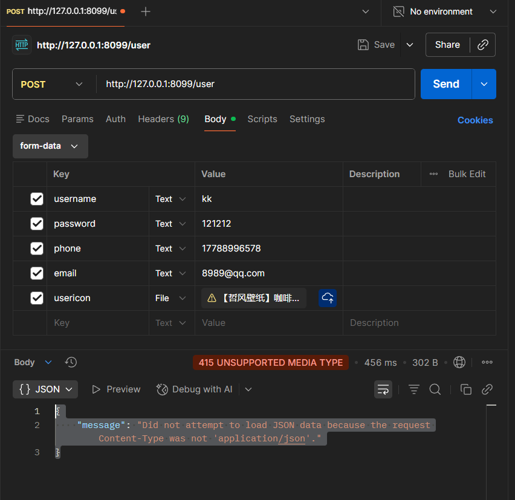

### 大坑   
对于restful的api设置步骤是有严格的对应的    

#### 先说自定义的返回类型   
```python
from flask_restful import Api, fields, marshal_with, Resource, reqparse
resp_fields = {
    'id': fields.Integer,
    'username': fields.String(attribute='username', default='匿名'),
    'phone': fields.String,
    'email': fields.String,
    # 'isDelete': fields.Boolean(attribute='isdelete'),
    'regidate': fields.DateTime(dt_format='rfc822')

}
```

>  上面这块儿就是你写的啥到时候marshalwith装饰的就返回啥  
> 但是一定要注意,这个字典的键虽然可以随便自己定义,但一般要对应于
> 数据库表的键，这样可以省时省力,但是如果实在是想自定义也可,只需要在  
> 后面加上attribute='数据库表中的字段'就可以      
> 


####  **下面是创建参数解析器(坑点)**  
```python
from flask_restful import reqparse
from werkzeug.datastructures.file_storage import FileStorage

parser = reqparse.RequestParser()
parser.add_argument('username', type=str, required=True, help='用户名不能为空', location=['form'])
parser.add_argument('password', type=str, location=['form'])
parser.add_argument('email', type=str, location=['form'])
parser.add_argument('isdelete',location=['form'])
parser.add_argument('user_icon', type=FileStorage, location=['files'])
```

> 最大的坑点就是这个   
> 每个写的解析参数都要制定好location,不然用postman会报返回类型错误   
> 