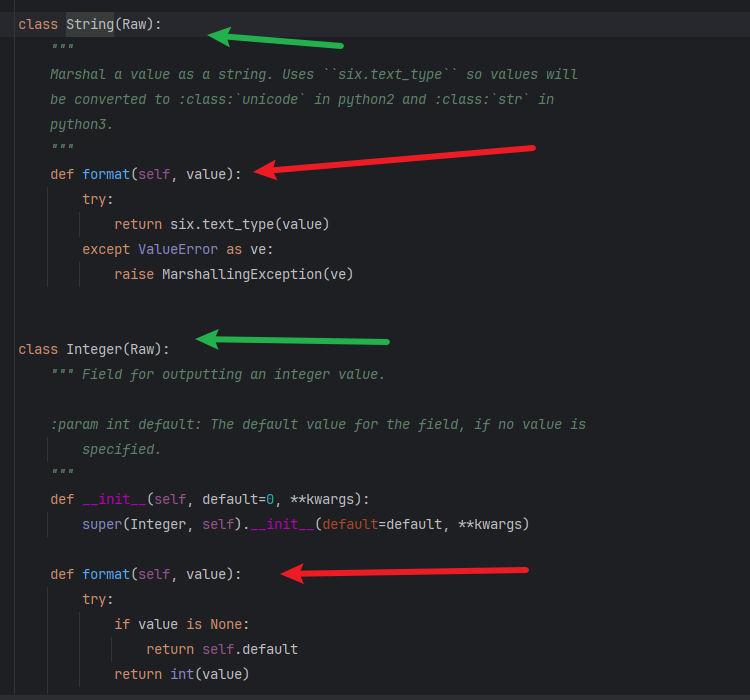
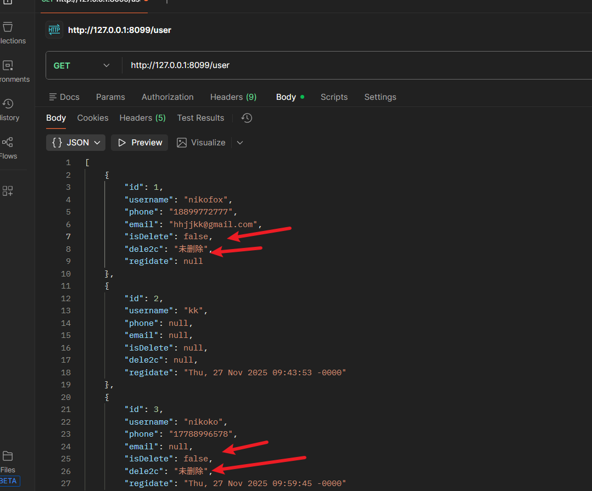
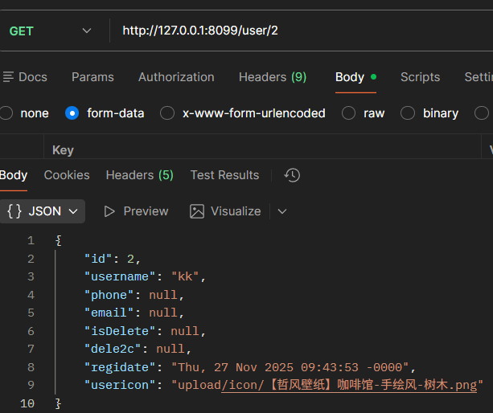
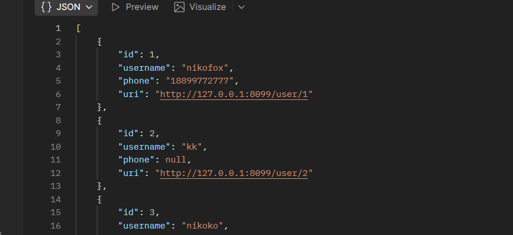

## Output Fields   

> 之前学的是render_template这样的返回模板的方式   
> 但是在restful中我们不需要操作模板           
```python
resp_fields={
    'id':fields.Integer,
    'name':fields.String(attribute='username',default='匿名'),
    'phone':fields.String,
    'email':fields.String,
    'regidate':fields.DateTime(dt_format='rfc822')

}
```

#### 一些参数的解释    

- attribute 指定的是对应数据库中的键,这个大字典当中,前面的键是给前端看的，当然,一般都是对应数据库中的  
键,但是如果不想让前端看着太繁琐，我们就可以自定义一个键,但是需要“通知”数据库这个自定义的键对应的数据库中 
的对应键(attribute)是哪个,譬如我们数据库中有一个叫username的键,但是我想让前端只关注它是啥而不细分  
那就可以给其指定的名字是name，但是绑定对应数据库中的键值是username就行   
- default 表示的是指定返回的默认内容


###  定义输出的“模板”   
>这个和fastapi中有些地方十分相似    
fastapi是自己定义一个返回模型的类然后使用responsemodel来使用   
而flask则是需要用fields来指明
```python
resp_fields={
    'id':fields.Integer,
    'name':fields.String,
    'phone':fields.String,
    'email':fields.String,
    'regidate':fields.DateTime(dt_format='rfc822')
    
}
```


### 使用marshal_with包装返回的数据

>指明之后需要使用marshal_with(fields)来使用  
> marshal_with是一个装饰器,它可以将要返回数据的请求按照指定的field的格式来返回数据
```python
class api_cbv(Resource):
    @marshal_with(resp_fields)
    def get(self):
        pass
    @marshal_with(resp_fields)
    def post(self):
        pass

```


### 高级用法,自定义fields
> 之前都是直接用内置的类型  
```python
resp_fields={
    'id':fields.Integer,
    'name':fields.String,
    'phone':fields.String,
    'email':fields.String,
    'regidate':fields.DateTime(dt_format='rfc822')
    
}
```
这样其实已经满足大部分需求，但是如果想自定义我们自己的类型该怎么办呢?  

因为这些类型在源码中都是继承Raw的，根据这个思路我们就可以自己来定义  

     


### 自定义fieds的类型
我们也可以照着这样的定义方式来自定义fields  

> 使用场景,isdelete返回的是True和False来对应删除和未删除  
> 那我们就构建一个fields来实现让其更易懂的转换
1. 先定义一个继承自fields.Raw的类并重写format方法
```python
class e2c_isdel(fields.Raw):  #1.必须继承fields.Raw
    def format(self, value): #2.必须重写format方法
        if value:
            return '已被删除'
        else:
            return '未删除'

```
2. 然后在返回字典的定义中使用它
```python
resp_fields = {
    'id': fields.Integer,
    'username': fields.String(attribute='username', default='匿名'),
    'phone': fields.String,
    'email': fields.String,
    'isDelete': fields.Boolean(attribute='isdelete'),
    'dele2c': e2c_isdel(attribute='isdelete'), #tips:指定对应的数据库键
    'regidate': fields.DateTime(dt_format='rfc822')

}
```

注意!!! attribute是为了指明自定义键名和表真实键名的绑定关系的!!!! 

  


### Url&otherConcreteFields 

先来说一下类似与fastapi返回模型定义中的内容   
譬如只有用户自己查看自己的才能看到自己的更多信息  
而别人只能查看到部分信息   


这是别人看到的
```python
resp_fields = {
    'id': fields.Integer,
    'username': fields.String(attribute='username', default='匿名'),
    'phone': fields.String,
    'email': fields.String,

}
```

这是自己看到的   
```python
resp_fields_detail = {
    'id': fields.Integer,
    'username': fields.String(attribute='username', default='匿名'),
    'phone': fields.String,
    'email': fields.String,
    'isDelete': fields.Boolean(attribute='isdelete'),
    'dele2c': e2c_isdel(attribute='isdelete'),  # tips:指定对应的数据库键
    'regidate': fields.DateTime(dt_format='rfc822'),
    'usericon':fields.String(attribute='user_icon'),
}
```

然后marshal_with的时候可以用这个新的返回模型  
```python
class User_single(Resource):
    @marshal_with(resp_fields_detail)
    def get(self, id):
        info = Userinfo.query.get(id)
        return info
```

   

### url的妙用    
_利用fields.Url传入端点(endpoint),可以实现我们实际应用中  
页面的详情链接,譬如一个响应数据中携带另外一个详情链接  
那么我们就可以使用fields.Url_     
**注意endpoint的写法**
```python
resp_fields = {
    'id': fields.Integer,
    'username': fields.String(attribute='username', default='匿名'),
    'phone': fields.String,
    'uri':fields.Url(endpoint='api.singleuser', absolute=True),

}
```

例如上面的我们只显示id,username,phone三个内容  
详情链接需要访问uri才可以查看    
如果指定了absolute的话就会返回绝对路径


    

点击uri的话会进入到新的路由

当然,也可以指定为https,但要有证书  
```python
'uri':fields.Url(endpoint='api.singleuser', absolute=True,scheme='https'),
```
