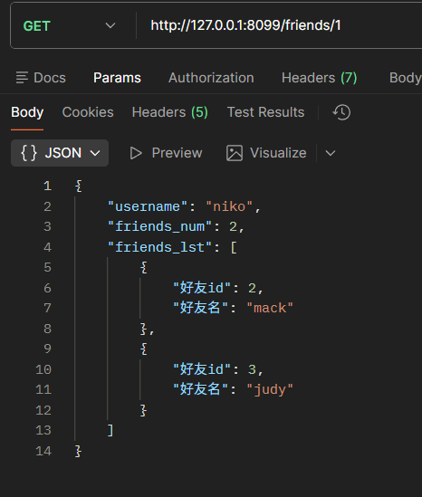
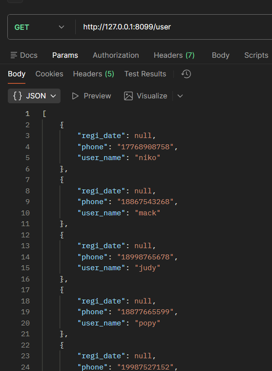
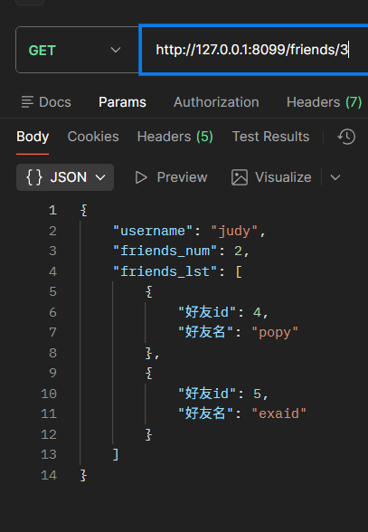

## 复杂结构的输出     
> 这个案例要实现的是好友关系操作   
> 譬如一个用户可以有多个好友,但好友也是用户     
> 那么就是用户表中存储所有用户的信息,创建一张好友关系表   
> 存储的是用户与用户之间的好友信息    

### 📃表的设计  
```python
"""
@File    :model.py
@Editor  : 百年
@Date    :2025/11/28 10:14 
"""

from exts.dbhelper import db, migrate
from datetime import datetime


class User(db.Model):
    __tablename__ = 'user'
    id = db.Column(db.Integer, primary_key=True, autoincrement=True)
    user_name = db.Column(db.String(32), nullable=False)
    phone = db.Column(db.String(11))
    regi_date = db.Column(db.DateTime, default=datetime.now)
    friends = db.relationship('Friends',foreign_keys='Friends.uid' ,backref='user', lazy='dynamic')

    def __str__(self):
        return self.user_name


class Friends(db.Model):
    __tablename__ = 'friends'
    id = db.Column(db.Integer, primary_key=True, autoincrement=True)
    uid = db.Column(db.Integer, db.ForeignKey('user.id'))
    fid = db.Column(db.Integer, db.ForeignKey('user.id'))
    create_at = db.Column(db.DateTime, default=datetime.now)

```

> 需要关注的是表之间的关系,因为Friends表本质上存储的是用户id对应的好友的用户id   
> 所以会用到联合主键   
> 但是!!!! 既然用到外键约束,而且是两个相同的外键约束,那么在主表中就需要创建foreign_keys的指定了   
> 

之前写的relationship中没有用到过这样的场景,属实新鲜     

这样就解决了外键相同时的relation的绑定问题

### 🔍表的查询设计与实现

```python
class FriendCBV(Resource):
    #tips:获取用户的朋友信息,传入一个用户id,获取该id的所有好友的id
    def get(self,uid):
        #tips:先定位到此人，利用.get进行主键查询
        usr = User.query.get(uid)
        #tips:拿到指定uid,去Friends表中拿
        uids_friends  = Friends.query.filter(Friends.uid==uid).all() #
        friends_lst=[]
        for friend in uids_friends:
            #tips 然后拿到此uid的所有fid,并在User表中查找
            fid=User.query.get(friend.fid)
            fname = fid.user_name
            f_info_set={
                '好友id':fid.id,
                '好友名':fname
            }
            friends_lst.append(f_info_set)
        uid_data={
            'username':usr.user_name,
            'friends_num':len(uids_friends),
            'friends_lst':friends_lst
        }
        return uid_data


api.add_resource(ApiCBV, '/user',endpoint='user')
api.add_resource(FriendCBV, '/friends/<int:uid>',endpoint='friends')
```


> 注意看查询语句的繁琐设计,这其实在设置完外键之后是没必要的,但是这样写方便理解底层的逻辑   
> 
> 

---
### ❗ marshal()手动序列化函数

- marshal(data,fields)

>与marshal_with()这样的自动序列化不同的是  
> marshal()可以实现更加复杂的，需要手动序列化的数据    

#### 示例代码 ⌨️   

```python
demo_field = {
    'regi_date': fields.String,
    'phone': fields.String,
    'user_name': fields.String

}


class ApiCBV(Resource):
    def get(self):
        users = User.query.all()
        return marshal(users, demo_field)
```
>
> 
可以看到返回的是一个列表嵌套字典的结构   


---  
当然了,我们还可以将此方法用在刚才那个示例中   

```python
friend_set={
    '好友id':fields.Integer(attribute='id'), #注意要指定attribute来对应数据库中的字段
    '好友名':fields.String(attribute='user_name'),
}
class FriendCBV(Resource):
    # tips:获取用户的朋友信息,传入一个用户id,获取该id的所有好友的id
    def get(self, uid):
        # tips:先定位到此人，利用.get进行主键查询
        usr = User.query.get(uid)
        # tips:拿到指定uid,去Friends表中拿
        uids_friends = Friends.query.filter(Friends.uid == uid).all()
        friends_lst = []
        for friend in uids_friends:
            # tips 然后拿到此uid的所有user对象f
            f = User.query.get(friend.fid)
           # NeW:注意这里不一样了,直接添加它到列表中,然后下面我们用marshal()来处理！！
            friends_lst.append(f)
        uid_data = {
            'username': usr.user_name,
            'friends_num': len(uids_friends),
            'friends_lst': marshal(friends_lst,friend_set) #调用marshal()来处理
        }
        return uid_data
```



✅ 优化查询代码
```python
class FriendCBV(Resource):
    # tips:获取用户的朋友信息,传入一个用户id,获取该id的所有好友的id
    def get(self, uid):
        # tips:先定位到此人，利用.get进行主键查询
        usr = User.query.get(uid)
        if not usr:
            return {'error':'该用户不存在'},404

        #NeW:优化查询速度,这样只需要两次查询而不是上面的n+1次查询
        #step1: 获取所有好友的fid列表
        friend_ids=[f.fid  for f in Friends.query.filter(Friends.uid == uid).all()]

        #step2:  一次性查询出所有好友User对象
        friends=User.query.filter(User.id.in_(friend_ids)).all()


        uid_data = {
            'username': usr.user_name,
            'friends_num': len(friends),
            # 'friends_lst': friends_lst
            'friends_lst': marshal(friends,friend_set)
        }
        return uid_data
```


---  

###  使用marshal_with()与fields.Nested   
> 此方法是最复杂的,推荐还是使用marshal()来处理自定义序列化   
> 因为这个自动序列化又得定义返回的fields又得自己写返回的data结构所以还不如直接自己写返回结构   
> 颇有脱裤子放屁的意思
```python
friend_set={
    '好友id':fields.Integer(attribute='id'),
    '好友名':fields.String(attribute='user_name'),
    '好友手机号':fields.String(attribute='phone'),
}
user_friend_fields={
    'username':fields.String,
    'friends_num':fields.Integer,
    'friends_lst':fields.List(fields.Nested(friend_set)),
}
class FriendCBV(Resource):
    @marshal_with(user_friend_fields)
    # tips:获取用户的朋友信息,传入一个用户id,获取该id的所有好友的id
    def get(self, uid):
        # tips:先定位到此人，利用.get进行主键查询
        usr = User.query.get(uid)
        if not usr:
            return {'error':'该用户不存在'},404

        #NeW:优化查询速度,这样只需要两次查询而不是上面的n+1次查询
        #step1: 获取所有好友的fid列表
        friend_ids=[f.fid  for f in Friends.query.filter(Friends.uid == uid).all()]

        #step2:  一次性查询出所有好友User对象实例
        friends=User.query.filter(User.id.in_(friend_ids)).all()


        uid_data = {
            'username': usr.user_name,
            'friends_num': len(friends),
            'friends_lst': friends #这里不用传给marshal了，而是marshal_with自动处理,用Nested指定的friend_set来处理了
        }
        return uid_data
```